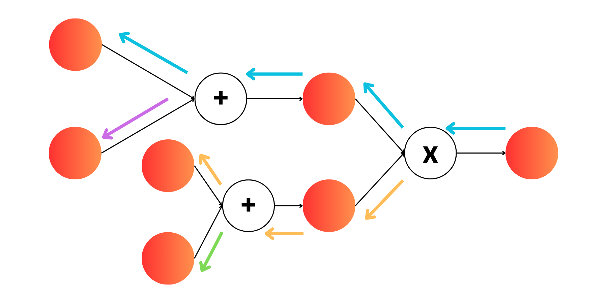

# MyTorch: AutoGrad

PyTorch is by far the most popular deep learning framework. But due to its incredible set of features and convenience, we can forget all the cool stuff that goes into making it even possible! This is an attempt to reproduce all of the core features we care about when training Neural Networks. 

## The Goal

Build a relatively robust Deep Learning Framework, using [CuPy](https://docs.cupy.dev/en/stable/index.html) as the backend for GPU processing and Distributed Training!

## 🚀Implemented Ops

### Tensor Arithmetic
| Operation        | Implemented |
|------------------|-------------|
| Add              | ✅          |
| Subtraction      | ✅          |
| Multiplication   | ✅          |
| Division         | ✅          |
| Power            | ✅          |
| Matmul           | ✅          |

### Reductions & Stats
| Operation    | Implemented |
|--------------|-------------|
| Sum          | ✅          |
| Mean         | ✅          |
| Var          | ✅          |
| Max          | ✅          |
| Argmax       | ✅          |

### Indexing & Reshaping
| Operation    | Implemented |
|--------------|-------------|
| Indexing     | ✅          |
| Equality     | ✅          |
| Transpose    | ✅          |
| Permute      | ✅          |
| Reshape      | ✅          |
| **Flatten**  | ❌          |
| **Concatenate** | ❌       |
| **Split / Chunk** | ❌     |

### Pointwise Functions
| Operation    | Implemented |
|--------------|-------------|
| Exp          | ✅          |
| Log          | ✅          |

## 🚀 Implemented Layers

### 🔸 Core Layers
| Operation   | Impl | Auto Backward | Manual Backward |
|-------------|------|---------------|-----------------|
| Linear      | ✅   | ✅            | ✅              |
| Embedding   | ✅   | ✅            | ❌              |
| Dropout     | ✅   | ✅            | ❌              |

### 🔸 Convolutions & Pooling
| Operation         | Impl | Auto Backward | Manual Backward |
|-------------------|------|---------------|-----------------|
| Conv2d            | ✅   | ❌            | ✅              |
| ConvTranspose2d   | ❌   | ❌            | ❌              |
| Conv1d            | ❌   | ❌            | ❌              |
| ConvTranspose1d   | ❌   | ❌            | ❌              |
| MaxPool2d         | ✅   | ❌            | ✅              |
| AvgPool2d         | ✅   | ❌            | ✅              |
| AdaptiveAvgPool2d | ✅   | ❌            | ✅              |
| Upsample / Interp | ❌   | ❌            | ❌              |

### 🔸 Normalization
| Operation   | Impl | Auto Backward | Manual Backward |
|-------------|------|---------------|-----------------|
| LayerNorm   | ✅   | ✅            | ✅              |
| BatchNorm   | ✅   | ❌            | ✅              |

### 🔸 Activations
| Operation   | Impl | Auto Backward | Manual Backward |
|-------------|------|---------------|-----------------|
| Sigmoid     | ✅   | ✅            | ✅              |
| ReLU        | ✅   | ✅            | ✅              |
| GeLU        | ✅   | ❌            | ✅              |
| Softmax     | ✅   | ✅            | ✅              |
| LeakyReLU   | ❌   | ❌            | ❌              |
| Tanh        | ❌   | ❌            | ❌              |

### 🔸 Losses
| Operation        | Impl | Auto Backward | Manual Backward |
|------------------|------|---------------|-----------------|
| CrossEntropyLoss | ✅   | ✅            | ✅              |
| MSELoss          | ✅   | ✅            | ✅              |

### 🔸 Recurrent
| Operation | Impl | Auto Backward | Manual Backward |
|-----------|------|---------------|-----------------|
| RNNCell   | ❌   | ❌            | ❌              |
| LSTMCell  | ❌   | ❌            | ❌              |
| GRUCell   | ❌   | ❌            | ❌              |

### Code Inspiration!
- Awesome implementation at [Autograd-from-Scratch](https://github.com/eduardoleao052/Autograd-from-scratch/tree/main) repository by [eduardoleao052](https://github.com/eduardoleao052)!
- [MicroGrad](https://github.com/karpathy/micrograd) is a great place to get started!

### Why Do We Care about AutoGrad?
In the previous section we implemented ManualGrad that definitely works but provides one inconvenience: For every forward function we define, we need to also explicitly define the backward function. This is completely unecessary though if we are able to define any complicated function as a composition of many functions. 

Typical computations are:
- adding
- subtracting
- multiplying
- dividing
- matrix multiplication
- exponentiating
- log
- averaging

With these limited computations, we can represent a large class of functions! Take Sigmoid again for example:

$$ sigmoid(x) = \frac{1}{1 + \exp(-x)} $$

But really, this is just a combination of exponentiation, sum and division! So as long as we know the derivative of the three sub-operations in sigmoid, we can use chain rule to get the overall derivative of the entire function! Lets write the composition of functions here:

$$a(x) = e^{-x}$$

$$b(x) = 1 + a(x)$$

$$\sigma(x) = \frac{1}{b(x)}$$

If you take the chain rule derivative of $\frac{d \sigma(x)}{d x}$ you will end up with the same formula as normal for the derivative of the Sigmoid function. 

### Computational Graph

The most important part of the AutoGrad system is building the computational graph to know the order of backpropagation. In [MicroGrad](https://github.com/karpathy/micrograd), Karpathy used something called [Topological Sort](https://www.geeksforgeeks.org/topological-sorting/) but I liked the method used by [Autograd-from-Scratch](https://github.com/eduardoleao052/Autograd-from-scratch/tree/main) where its almost like a Depth-First Gradient accumulation on the graph. We will implement both as it only requires a few changes!

You will find the Topological Sort in the files ```tensor.py```, ```functional.py``` and ```modules.py```. Additionally you will find the same methods with small changes to make it recursive in ```recursive_tensor.py```, ```recursive_functional.py```, ```recursive_modules.py```. 

#### Example 1: Gradient Propagation 


Like in every neural network, we are propagating gradients from the end of the network back to the beginning. This is done recursively in the implementation! Lets start at the end and work back. 

The last operation we do is Multiplication and we need to propagate the gradients to the inputs of that operation. There are two paths here, going up the blue path and down the yellow path. Lets just say the top paths appears first in the recursion, it doesn't really matter you could also do bottom path first!

The gradients for the top path then propagate back again to the top Plus node, and again we propagate the gradient to the top-left most node (at the end of the blue path). Now that we are at the deepest part of the graph, we can then go back up a step again and complete the purple path. 
 
We then go all the way back up again and then go down the yellow path, again going all the way down always taking the top path, and then working our way back up completing the green path. By doing this we will recursively iterate through the entire graph!

This should remind you very closely of Depth-First Search 


### Example 2: Barriers to Gradient Propagation


Depth first search is not exactly correct though. Lets look at this example! Just like before we start at the end and work our way back. We will first propagate our gradient down the blue path just like before. Then we will once we get to the end of the blue path, we can move up a node and then update the light-blue node using the orange path. Now if we kept Depth First search going, we would continue propagating our gradients from the light-blue node **BUT THIS IS WRONG**. The light blue node has a dependencies from two separate branches. 

This is why we track our children of every node. Until a node has exhasted all its children (i.e. all the paths have come to it) we cannot continue onwards. The light-blue node in this case has 2 children. Doing the top path will exhaust one of them, but we must complete the second path as well to exhast the second child. Therefore we gate our Depth First Search so we dont continue to propagate past a node that hasn't been fully exhasted!

So now, we use the orange path to give our first gradient injection into the light-blue node and then work our way back up and then continue down the yellow path. Once the yellow path ends on the light-blue node, we can then propagate the gradient back again via the purple path and then green path for the final nodes. 

#### Tiny Caveat

I am most definitely not a computer scientist, so maybe some of the terminology I used is wrong. I am pretty sure this is what is happening, but if you have any better explanation please let me know!

### Blending AutoGrad and Manual Grad

Technically we can do everything with Autograd. If you want, many of the layers have both a manual and auto mode. But, that isn't always efficient. For example, we can do automatic differentiation of the Softmax function and it will work fine. But we know the derivative of softmax, so for many of the known ops I have added in the manual backward pass as its just more memory efficient and it keeps us from having to store more intemediate states. 

```python
def relu(x, auto=False):
    if auto: # Use Autograd
        mask = Tensor(cp.where(x.data < 0, 0, 1).astype(cp.float32))
        return x * mask

    else: # Use manually defined backward pass
        out_data = cp.maximum(x.data, 0, out=cp.empty_like(x.data))

        def _relu_backward(input_grad):
            if x.requires_grad:
                grad_input = input_grad * (x.data > 0)
                if x.grad is None:
                    x.grad = cp.zeros_like(x.data, dtype=cp.float32)
                x.grad += grad_input

        requires_grad = x.requires_grad and Tensor.build_graph_enabled()
        out = Tensor(
            out_data,
            requires_grad=requires_grad,
            grad_fn=_relu_backward if requires_grad else None,
            grad_fn_name="<ReLUBackward>" if requires_grad else None
        )

        if requires_grad:
            out._add_parents(x)

        return out
```


## Features

### MyTorch is a Fully Autograd Based System

I have implemented the most important operations, although theres always more! But you can use it like this:

```python
from mytorch import Tensor
import cupy as cp 

a = Tensor(cp.ones((1,)), requires_grad=True)
b = a + 2
c = b**2

print(c)
# Output:
[9.], grad_fn=<PowBackward>, device=cuda:0

c.backward()
print(a.grad)
# Output:
[6.]

```

### MyTorch Basic Usage

Just as a very simply explanation of the code, the heart of the AutoGrad system is found in the ```Tensor``` class found in ```mytorch.tensor```. These tensors have all of the operations defined above along with their derivatives and ability to store the computational graph! The entire Tensor class is just a wrapper on top of standard cupy operations, we just manually track the gradients for backpropagation!

```python
import cupy as cp
import mytorch

tensor = mytorch.Tensor(cp.array([1,2,3]), requires_grad=True)
```

The use of this should be pretty similar to vanilla PyTorch to make it as familiar as possible!

```python
import cupy as cp
import numpy as np
import mytorch 
import mytorch.nn as nn
import mytorch.optim as optim
from mytorch.utils.data import DataLoader

class MyTorchMNIST(nn.Module):

    def __init__(self):

        self.fc1 = nn.Linear(784, 128)
        self.fc2 = nn.Linear(128, 64)
        self.fc3 = nn.Linear(64, 32)
        self.fc4 = nn.Linear(32, 10)

        self.activation = nn.Sigmoid()

    def forward(self, x):

        x = self.activation(self.fc1(x))
        x = self.activation(self.fc2(x))
        x = self.activation(self.fc3(x))
        x = self.fc4(x)

        return x

model = MyTorchMNIST()
print(model)

### Prep Dataset ###
train = MNIST("../../data", train=True, download=True)
test = MNIST("../../data", train=False, download=True)

def collate_fn(batch):

    ### Prep and Scale Images ###
    images = cp.stack([cp.array(i[0]).reshape(28*28)for i in batch]) / 255

    ### One Hot Encode Label (MNIST only has 10 classes) ###
    labels = [i[1] for i in batch]

    images = mytorch.Tensor(images).astype(cp.float32)
    labels = mytorch.Tensor(labels)

    return images, labels

trainloader = DataLoader(train, batch_size=args.batch_size, collate_fn=collate_fn, num_workers=2)
testloader = DataLoader(test, batch_size=args.batch_size, collate_fn=collate_fn, num_workers=2)

optimizer = optim.Adam(model.parameters(), lr=args.lr)

loss_fn = nn.CrossEntropyLoss(auto=False)

for epoch in range(args.epochs):

    print(f"Training Epoch {epoch}")

    train_loss, train_acc = [], []
    eval_loss, eval_acc = [], []

    model.train()
    for images, labels in tqdm(trainloader):

        pred = model(images)
        
        loss = loss_fn(pred, labels)
        loss.backward()
        optimizer.step()
        optimizer.zero_grad()
        ...

    model.eval() # Supported Eval
    for images, labels in tqdm(testloader):

        with mytorch.no_grad(): # Supported Context Manager
            pred = model(images)
            
        loss = loss_fn(pred, labels)
        ...
    
```

### Convolutions

An important architecture for lots of architectures is the convolution! Although we can't reach max throughput on convolution ops like custom cuda kernels can, we can get close using the Im2Col/Col2Im algorithm! They work the same way as pytorch!

```python
class ConvNet(nn.Module):

    def __init__(self):
        super().__init__()

        self.conv1 = nn.Conv2d(in_channels=3, 
                               out_channels=32, 
                               kernel_size=3,
                               stride=2, 
                               padding=1)

        self.bn1 = nn.BatchNorm2d(32)
        self.drop1 = nn.Dropout(0.1)

        self.conv1 = nn.Conv2d(in_channels=3, 
                               out_channels=32, 
                               kernel_size=3,
                               stride=2, 
                               padding=1)
                               
        self.bn1 = nn.BatchNorm2d(32)
        self.drop1 = nn.Dropout(0.1)

        self.conv2 = nn.Conv2d(in_channels=3, 
                               out_channels=32, 
                               kernel_size=3,
                               stride=2, 
                               padding=1)
                               
        self.bn2 = nn.BatchNorm2d(32)
        self.drop2 = nn.Dropout(0.1)
        
        ...

    def forward(self, x):
        
        # Standard Forward Definition 
        ...


```

### Transformers

Well we have linear layers, we may as well build a transformer! And that works out too! For example here is the attention mechanism, but you can find mroe in ```models/gpt2.py```

```python
class Attention(nn.Module):

    def __init__(self, embed_dim, num_heads, attn_dropout_p=0.1):
        super().__init__()
        ### Sanity Checks ###
        assert embed_dim % num_heads == 0, "Double check embedding dim divisible by number of heads"

        ### Attention Head Dim ###
        self.embed_dim = embed_dim
        self.num_heads = num_heads
        self.head_dim = embed_dim // num_heads

        ### Attention Projections ###
        self.q_proj = nn.Linear(embed_dim, embed_dim)
        self.k_proj = nn.Linear(embed_dim, embed_dim)
        self.v_proj = nn.Linear(embed_dim, embed_dim)
        self.softmax = nn.Softmax()
        self.attn_drop = nn.Dropout(dropout_p=attn_dropout_p)

        ### Post Attention Projection ###
        self.out_proj = nn.Linear(embed_dim, embed_dim)
        self.proj_drop = nn.Dropout(dropout_p=attn_dropout_p)
        

    def forward(self, x, attention_mask=None):
     
        ### Store Shape ###
        batch, seq_len, embed_dim = x.shape

        ### Flatten Batch and Seq Len Dimension ###
        x = x.reshape(batch*seq_len, embed_dim)
   
        ### Compute Attention with Flash Attention ###
        q = self.q_proj(x).reshape(batch, seq_len, self.num_heads, self.head_dim).transpose(1,2)
        k = self.k_proj(x).reshape(batch, seq_len, self.num_heads, self.head_dim).transpose(1,2)
        v = self.v_proj(x).reshape(batch, seq_len, self.num_heads, self.head_dim).transpose(1,2)
       
        ### Compute Attention (Attention Mask has shape Batch x Sequence len x Sequence len) ###
        scores = (q @ k.transpose(-2, -1)) / self.head_dim**0.5
    
        ### Add attention mask if it exists ###
        if attention_mask is not None:
            scores += attention_mask
     
        attention = self.softmax(scores, dim=-1)
        attention = self.attn_drop(attention)

        output = attention @ v
        output = output.transpose(1,2).reshape(batch*seq_len, embed_dim)
        
        ### Compute Output Projection (on flattened dimension) ###
        output = self.out_proj(output)
        output = self.proj_drop(output)

        output = output.reshape(batch, seq_len, embed_dim)
        
        return output
```

### Distributed Training

If you got multiple GPUs why not use them? Here is a wrapper like [Huggingface Accelerate](https://huggingface.co/docs/accelerate/en/index) to allow you to train on multiple GPUs (given you are on the same node!). This is possible due to CuPy and its support for NCCL!

```python
... 
from miniddp.accelerate import Accelerator
accelerator = Accelerator()

class MyTorchMNIST(nn.Module):
    def __init__(self):
        super().__init__()
        
        self.fc1 = nn.Linear(784, 512)
        self.drop1 = nn.Dropout(0.1)
        self.fc2 = nn.Linear(512, 10)
        self.activation = nn.ReLU()

    def forward(self, x):
        x = self.drop1(self.activation(self.fc1(x)))
        x = self.drop2(self.activation(self.fc2(x)))
        x = self.fc4(x)
        return x

model = MyTorchMNIST()
accelerator.print(model) # Only prints on main rank

train = MNIST("../../data", train=True, download=False)

def collate_fn(batch):
    images = np.concatenate([np.array(i[0]).astype(np.float32).reshape(1,784) for i in batch]) / 255
    labels = np.array([i[1] for i in batch])
    return images, labels

trainloader = DataLoader(train, batch_size=16, collate_fn=collate_fn, num_workers=2)
optimizer = optim.Adam(model.parameters(), lr=0.001)
loss_fn = nn.CrossEntropyLoss()

### Prepares everything for DDP ###
model, optimizer, trainloader, testloader = accelerator.prepare(
    model, optimizer, trainloader, testloader
) 

for epoch in range(NUM_EPOCHS):

    model.train()
    for images, labels in tqdm(trainloader, disable=not accelerator.is_main_process()):
        images = mytorch.Tensor(images)
        labels = mytorch.Tensor(labels)

        pred = model(images)
        loss = loss_fn(pred, labels)

        # Backward w/ all_gather ops
        accelerator.backward(loss)
        optimizer.step()
        optimizer.zero_grad()

        train_loss.append(accelerator.gather_for_metrics(loss))
```

### Should You Use This?

No! PyTorch is better in every way. These methods use about 30% more GPU memory and run about 30% slower that its PyTorch equivalent. This is obviously the case as PyTorch uses a lightweight autograd mechanism building C++ and have custom CUDA/Triton kernels that fuse many of the operations we are doing here. 

But, its great to learn from to understand exactly how a lot of these ideas come together to build modern neural network frameworks!


