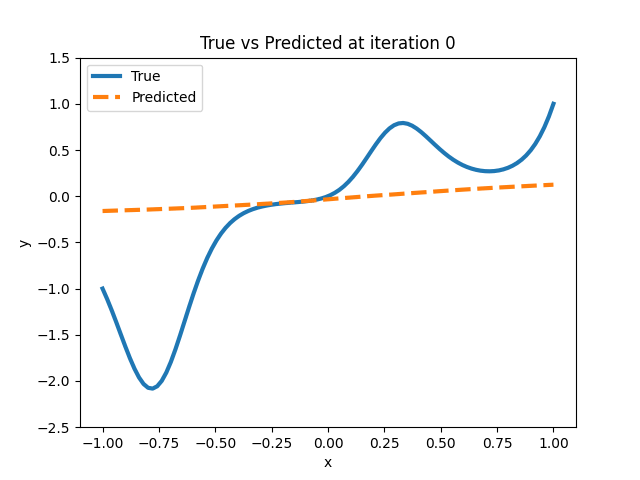

# ManualGrad



As opposed to AutoGrad that you find in PyTorch, we will be starting our Neural Network journey with ManualGrad! In ManualGrad we will compute both the forward operation and its backward derivative by hand! Of course this isn't fun because AutoGrad in PyTorch does this all for you, but it is important to learn! The operations we will focus on are the following:

- Linear Layers
- Convolutional Layers
- Softmax
- Cross Entropy
- Sigmoid 
- ReLU
- Dropout
- BatchNorm2d

We can then build simple regression models and image classification models! For simplicity, we will also use ```CuPY``` which has very similar syntax to numpy, just so we can run this on GPUs without much of a challenge!