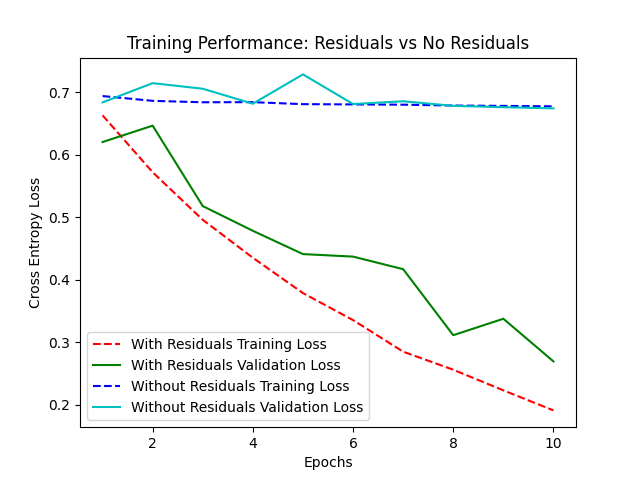

### Going Deeper with Residual Connections &nbsp; 

The "Deepness" of a neural network is determined by how many computational layers we include
in a model. It was quickly shown though that the deeper a model got, the harder it is to optimize
until the point gradient descent is no longer able to do anything. Residuals were proposed in the paper
[Deep Residual Learning for Image Recognition](https://arxiv.org/pdf/1512.03385.pdf) where earlier 
layers were summed to later layers of computation, offering additional paths for gradients to flow
backward! ResNet introduced a pivotal concept that is used all over modern Deep Learning today. 

#### We will be exploring a couple of things in this notebook!
- Deep dive into backpropagation, some of its mathematical derivations and limitations
- Implementation of the Larger ResNet Models (50, 101 and 152 Layers)
- Training ResNet With and Without Residuals to compare training performance

