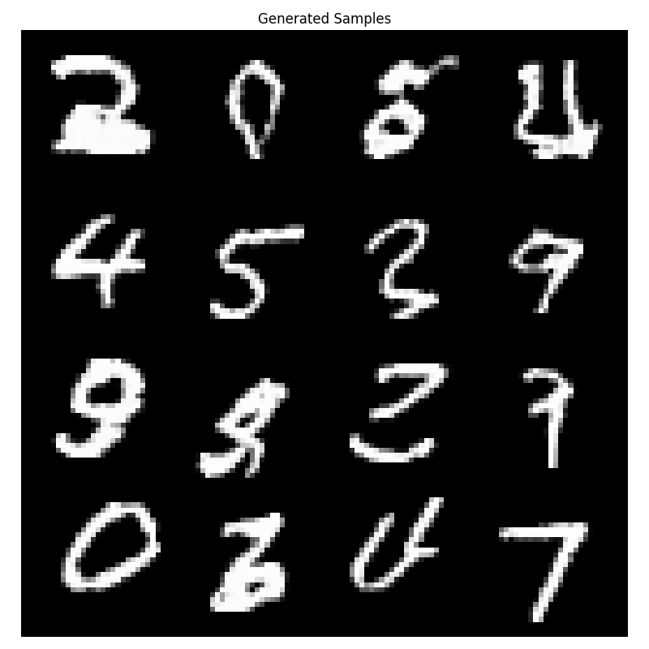

# Autoregressive Data Generation

What if you could generate Images one pixel at a time, or audio one sample at a time? That is exactly what Autoregressive generation is! This is a powerful method, but less used today due to more powerful methods like Diffusion and GANs. None-the-less, it is important so lets explore it!


## Causality Is Crucial
Autoregressive implies something crucial, Causality. Causality is pretty easy to imagine for things like Audio or Text. For example in LLMs, we typically want to predict the next token given the previous ones. This means during training, you can't show the future to the model! But what does causality imply in Images? The issue is Images are 2 dimensional, so what if we say a specific pixel is dependent on all the pixels before it and above it!


### Probability Chain Rule

This entire idea comes from the probability chain rule, where a the likelihood of a sequence can be written as:

$p(x_1, x_2, x_3, x_4, ...) = p(x_1)p(x_2|x_1)p(x_3|x_1,x_2)p(x_4|x_1,x_2,x_3)$

And this is exactly what we are trying to learn, the data distribution of $p(x)$

## Pixel Recurrent Nerual Networks

This [work](https://arxiv.org/abs/1601.06759) by A oord et. al. essentially explored 3 different ways of processing images for Autoregressive generation.

- PixelRNN: Process one row at a time using Recurrent Networks
- PixelCNN: Using a Convolution-Only model to do Autoregressive Generation
- Diagonal BiLSTM: Process RNNs along the diagonals of the image

I have never seen the Diagonal LSTM ever used anywhere so we will omit that here! So we will focus on PixelRNN and PixelCNN!

### Causal Masking 

The first step is, how do we perform convolutions in a Causal manner? Convolutions are centered on some pixel and look at all the pixels around it! But we want to restrict our convolution to look at only pixels before and above our target pixel. This is done through the **Mask Type A** where we convolve our image with a kernel that masks out the center pixel and pixels after/below. This ensures that each output pixel is a weighted sum of only the pixels before and above it!


### PixelRNN

The first layer of every model is a Convolution with **Mask Type A**. This ensures that the output is fully causal. The Pixel RNN then processes each row of the output with a horizontal (1D) kernel and maintains a hidden state (just like an LSTM) across the rows. The key idea is this new convolution is **Mask Type B**, which does **NOT** mask the center pixel. This is fine as our center pixel is an aggregation of previous and above, so now that we are in the second layer of our model we can look at it without breaking causality!

We then pass our hidden state from row to row so we can get context over the entire sequence!


### PixelCNN

PixelRNN is nice, but very slow to train. We are essentially for looping through each row of an image, so we are unable to parallelize this. So what if we could use convolutions only without any RNNs. This has the benefit that we can process the image quickly, but we lose having context over the full history as we no longer have some hidden state. To do this, we will process the output of our Casual Masking A kernel with more convolutions of Type B again (which doesn't mask the center pixel)


We do have something that can help though! As we stack layers, our receptive field gets larger and larger! So as long as we have a sufficiently deep enough model, we will get enough of that previous history. 

## Generating

Generations on the other hand is really slow, because we have to generate our images **ONE STEP AT A TIME!!** This means if we have even a small picture like a ```32 x 32``` image, we will have to do ```1024``` forward passes to predict all of them. 


