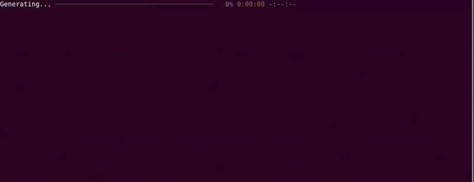

# Language Diffusion Model



Most language models uptil now have been autoregressive, we predict the future token conditioned on all the past tokens. Language Diffusion Models (like LLADA) give an alternative approach, where we instead start our generation with a canvas of just blank ```[MASK]``` tokens and iteratively denoise/refine it to get our final prediction. This repository implements just that! Now LLADA is a massive 8 Billion parameter model, so its hard to reproduce that without significant resources. Luckily, we have models that already do Masked Language Modeling! Models like BERT, RoBERTa, etc... are already pretrained, so why not finetune them for the Language Diffusion Task?

I opt to use [ModernBERT](https://huggingface.co/blog/modernbert) instead mainly due to having a much larger context length of 8192, where models like BERT/RoBERTa can only process lengths of 512. The model I train is a roughly 400 Million parameters (ModernBERT-Large)

## References
- Really cool (and simplified repo) for LDM Pretraining by [gumran](https://github.com/gumran/language-diffusion/tree/master)
- Original work by [LLADA](https://github.com/ML-GSAI/LLaDA) team  

## PreTraining

### Prepare Data

The first step is pretraining our model on the diffusion task. To do this we need to prepare our pretraining data. I opt to use the Huggingface Fineweb and Wikipedia datasets providing about 40 Billion tokens to train on! You can also try a smaller dataset like the Gutenberg book corpus. 

```bash
python prepare_pretrain_data.py \
    --test_split_pct 0.005 \
    --context_length 1024 \
    --path_to_data_store "<PATH_TO_SAVE_TOKENIZED_DATA>" \
    --huggingface_cache_dir "<PATH_TO_HF_CACHE>" \
    --dataset_split_seed 42 \
    --num_workers 24 \
    --hf_model_name "answerdotai/ModernBERT-large" \ # change to whatever huggingface model you want
    --large_dataset # Dont use --large_dataset if you only want gutenberg book corpus
```

### Pretrain Model 

Pretraining for Diffusion is pretty easy. Take a sample, randomly sample some value between 0 and 1 (uniformly) and then mask that proportion of the text. This is important as our typical masked language models have only been trained to uncover masked data when only 15% is missing. Now we can have upto the entire 100% of the data masked!

```bash
accelerate launch pretrain.py \
    --experiment_name "LDM_Pretraining" \
    --working_directory "work_dir" \
    --hf_model_name "answerdotai/ModernBERT-large" \
    --path_to_prepped_data "<PATH_TO_SAVE_TOKENIZED_DATA>" \
    --num_training_steps 500000 \
    --per_gpu_batch_size 64 \
    --gradient_accumulation_steps 2
```

I trained on a 4xA100 Node so with a batch size of 256. Im sure much larger batches would have helped, but I didn't want to wait a week for results!

## Finetune for Question Answering

Great, we now have a model that can just generate text. But that isn't nearly as interesting as a model that can answer questions. So lets build a dataset for this. The Alpaca dataset is pretty common with about 50K question/answer pairs so lets go with that!

### Prepare SFT Data
The ModernBERT architecture doesn't support a Chat Template so we add it in, in the ```tokenizer.py``` file!

We first convert all the data to the ChatTemplate format:

```python
[
    {"role": "user", "content": query},
    {"role": "assistant", "content": response}
]
```

And then we just save the tokenized data for training!

```bash
python prepare_sft_data.py \
    --test_split_pct 0.01 \
    --context_length 1024 \
    --path_to_data_store "<PATH_TO_SAVE_TOKENIZED_ALPACA_DATA>" \
    --huggingface_cache_dir "<PATH_TO_HF_CACHE>" \
    --dataset_split_seed 42 \
    --num_workers 24 \
    --hf_model_name "answerdotai/ModernBERT-large"
```

### Finetune on Question/Answer Pairs

We will again train our model on this data, but there is one caveat. We will continue doing random masking with uniformly selected proportions, **BUT** we will only mask our answers. So the question tokens will never be masked out, only the responses. This is why in our ```prepare_sft_data.py``` method, we compute a ```get_answer_mask``` so we know which tokens are questions and which are answers. 

```bash
accelerate launch finetune_sft.py \
    --experiment_name "LDM_Pretraining_large_ft_alpaca" \
    --path_to_pretrained_checkpoint <PATH_TO_MODEL.SAFETENSORS> \
    --working_directory "work_dir" \
    --hf_model_name "answerdotai/ModernBERT-large" \
    --path_to_prepped_data "<PATH_TO_SAVE_TOKENIZED_ALPACA_DATA>"
```


### Inference

Now that your model is done you can inference it! Just uses the ```inference.py``` file like this:


```bash
python inference.py \
    --safetensors_path "<PATH_TO_MODEL.SAFETENSORS>" \
    --seq_len 512 \ # Supports upto 1024 in our setup
    --num_steps 512 \ # You can increase this to potentially get better results
    --hf_model_name answerdotai/ModernBERT-large \
    --prompt "What is artificial intelligence" # Prompt you want to ask the model
```